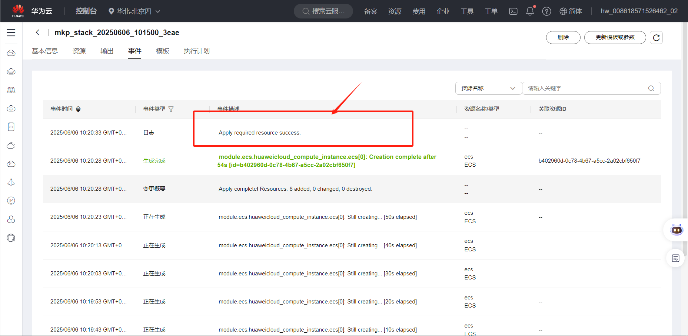
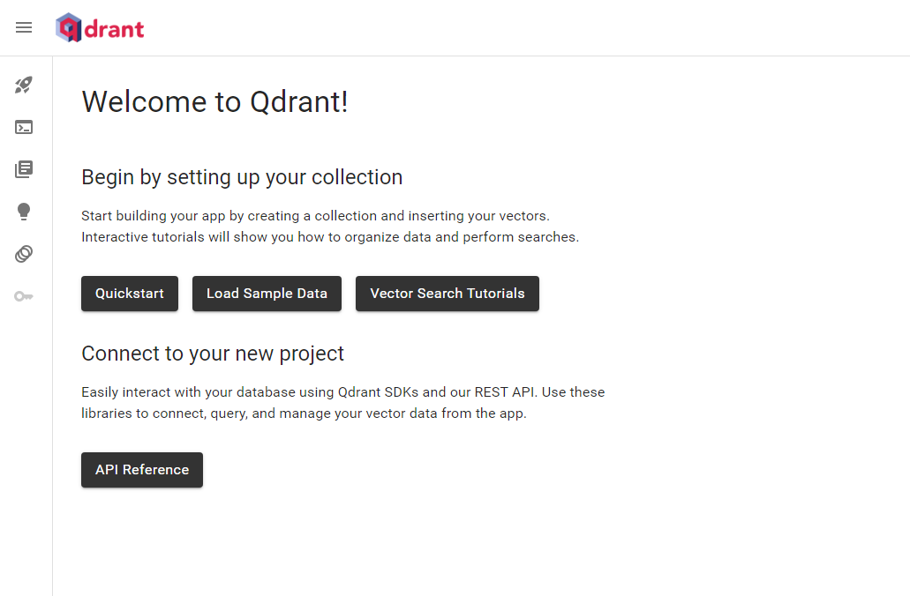

# superduper智数融合平台使用指南


# 一、商品链接


[superduper智数融合平台](https://marketplace.huaweicloud.com/hidden/contents/3105d1ab-eed7-48bc-9961-5d53369c6012#productid=OFFI1146359918988120064)

# 二、商品说明


superduper是一款面向开发者和企业的AI应用开发与数据库集成平台，能够简化AI模型与Qdrant、MySQL等多种数据库交互。旨在降低AI应用落地门槛，提供模块化、可扩展的工具链，帮助快速实现RAG检索增强生成、智能问答等场景。本商品通过鲲鹏服务器+EulerOS2.0进行安装部署

# 三、商品购买


您可以在云商店搜索 **superduper智数融合平台**。

其中，地域、规格、推荐配置使用默认，购买方式根据您的需求选择按需/按月/按年，短期使用推荐按需，长期使用推荐按月/按年，确认配置后点击“立即购买”。

## 3.1 使用 RFS 模板直接部署


 
必填项填写后，点击 下一步


创建直接计划后，点击 确定


点击部署，执行计划

如下图“Apply required resource success. ”即为资源创建完成


# 3.2ECS 控制台配置


### 准备工作


在使用ECS控制台配置前，需要您提前配置好 **安全组规则**。

> **安全组规则的配置如下：**
>
> - 入方向规则放通端口6333，必须包含这些端口才能正常访问使用
> - 入方向规则放通 CloudShell 连接实例使用的端口 `22`，以便在控制台登录调试
> - 出方向规则一键放通

### 创建ECS


前提工作准备好后，选择 ECS 控制台配置跳转到[购买ECS](https://support.huaweicloud.com/qs-ecs/ecs_01_0103.html) 页面，ECS 资源的配置如下图所示：

选择CPU架构 

选择服务器规格 
选择镜像 
其他参数根据实际请客进行填写，填写完成之后，点击立即购买即可 


> **值得注意的是：**
>
> - VPC 您可以自行创建
> - 安全组选择 [**准备工作**](#准备工作) 中配置的安全组；
> - 弹性公网IP选择现在购买，推荐选择“按流量计费”，带宽大小可设置为5Mbit/s；
> - 高级配置需要在高级选项支持注入自定义数据，所以登录凭证不能选择“密码”，选择创建后设置；
> - 其余默认或按规则填写即可。

# 商品使用


## superduper使用

运行
```
conda activate superduper

cd /home
```
启动qdrant服务：
```
docker run -p 6333:6333 qdrant/qdrant
```
然后就能打开网页 https:ip:6333/dashboard



接着运行superduper代码
```
cd /home/superduper

python app.py
```


主要实现是将一组数据通过模型编码为向量，并添加到qdrant数据库中，然后使用进行查询，输出结果。Qdrant用来存储向量数据，高效邻近搜索。SuperDuperDB 是一个 AI-native 数据抽象层，用于简化 ML 模型与数据库之间的交互。

### 参考文档


[superduper官方文档](https://github.com/superduper-io/superduper)

